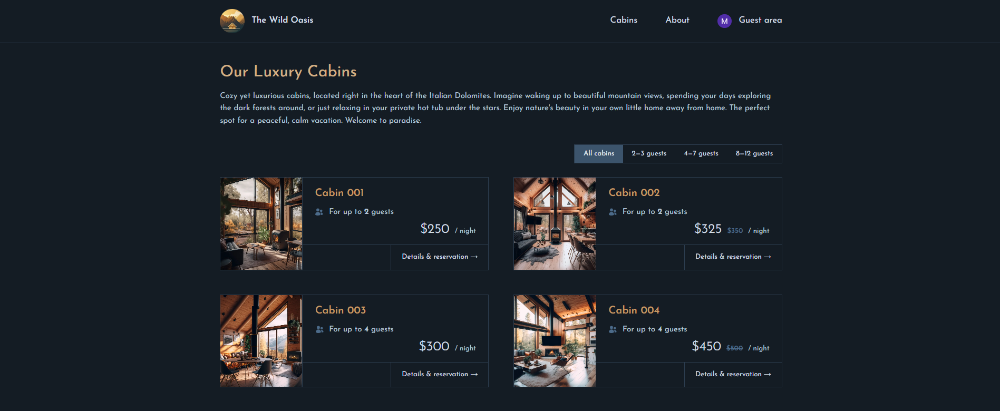
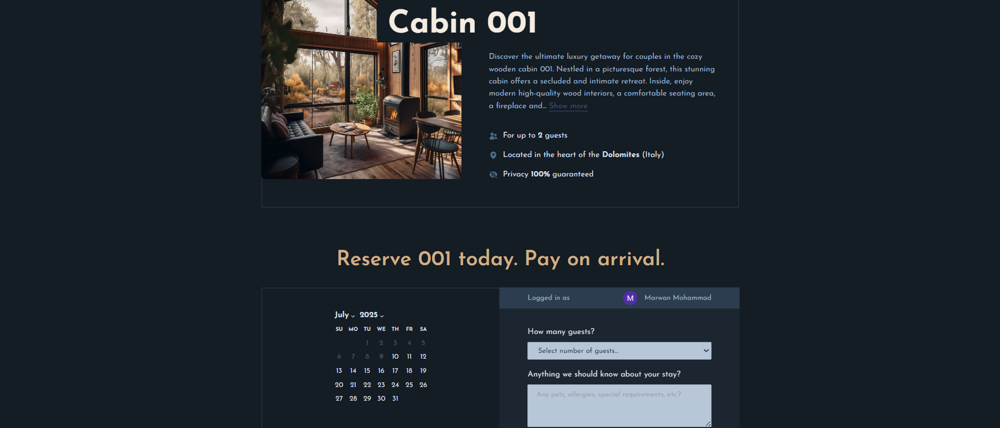
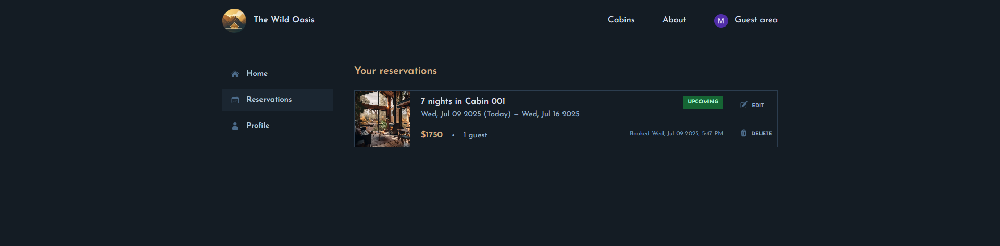

# 🏔️ The Wild Oasis Website

A luxury cabin booking website built with Next.js 14, offering guests the opportunity to book stunning accommodations in the heart of the Italian Dolomites.


## ✨ Features

### 🏡 **Cabin Management**

- Browse luxury cabins with detailed information
- View cabin capacity, pricing, and amenities

### 📅 **Booking System**

- Interactive date picker with blocked unavailable dates
- Dynamic pricing with discounts
- Guest capacity selection
- Special requirements and observations

### 👤 **User Authentication**

- Google OAuth integration via NextAuth.js
- Guest profile management
- Protected account pages

### 📱 **User Account Features**

- View and manage reservations
- Edit booking details
- Update profile information

## 🛠️ Tech Stack

- **Frontend**: Next.js 14, React 18
- **Styling**: Tailwind CSS
- **Authentication**: NextAuth.js with Google Provider
- **Database**: Supabase (PostgreSQL)
- **Icons**: Heroicons
- **Date Handling**: date-fns, react-day-picker

## 📷 Screenshots

### Cabins Page



### Cabin Page



### Cabins Reservations Page



## 🚀 Getting Started

### Prerequisites

- Node.js 18+
- npm or yarn
- Supabase account
- Google OAuth credentials

### Installation

1. **Clone the repository**

   ```bash
   git clone https://github.com/Marwan878/the-wild-oasis-website.git
   cd the-wild-oasis-website
   ```

2. **Install dependencies**

   ```bash
   npm install
   ```

3. **Environment Variables**

   Create a `.env.local` file in the root directory:

   ```env
   # Supabase
   SUPABASE_URL=your_supabase_url
   SUPABASE_ANON_KEY=your_supabase_anon_key

   # NextAuth.js
   NEXTAUTH_URL=http://localhost:3000
   NEXTAUTH_SECRET=your_nextauth_secret

   # Google OAuth
   AUTH_GOOGLE_ID=your_google_client_id
   AUTH_GOOGLE_SECRET=your_google_client_secret
   ```

4. **Database Setup**

   Set up your Supabase database with the following tables:

   - `cabins` - Cabin information and pricing
   - `bookings` - Reservation data
   - `guests` - User profiles
   - `settings` - Application settings

5. **Run the development server**

   ```bash
   npm run dev
   ```

   Open [http://localhost:3000](http://localhost:3000) in your browser.

## 📁 Project Structure

```
the-wild-oasis-website/
├── app/
│   ├── _components/          # Reusable React components
│   ├── _lib/                 # Utility functions and configurations
│   │   ├── actions.js        # Server actions
│   │   ├── auth.js          # NextAuth configuration
│   │   ├── data-service.js  # Supabase data functions
│   │   └── supabase.js      # Supabase client
│   ├── _styles/             # Global styles
│   ├── about/               # About page
│   ├── account/             # User account pages
│   ├── api/                 # API routes
│   ├── cabins/              # Cabin listing and details
│   └── login/               # Authentication page
├── public/                  # Static assets
└── middleware.js            # Route protection
```

## 🔧 Available Scripts

- `npm run dev` - Start development server
- `npm run build` - Build for production
- `npm run start` - Start production server
- `npm run prod` - Build and start production server
- `npm run lint` - Run ESLint

## 🌟 Key Features Explained

### **Responsive Design**

The website is fully responsive with breakpoints for mobile, tablet, and desktop views using Tailwind CSS.

### **Server-Side Rendering**

Leverages Next.js 14's App Router for optimal performance with server-side rendering and static generation.

### **Authentication Flow**

- Users sign in with Google
- New users are automatically created as guests
- Protected routes
- Session management with NextAuth.js

### **Booking Process**

1. Browse available cabins
2. Select dates using the interactive calendar
3. Choose number of guests
4. Add special requirements
5. Admin confirms reservation

## 🚀 Deployment

The application is ready for deployment on platforms like:

- **Vercel** (Recommended for Next.js)
- **Netlify**

### Vercel Deployment

1. Connect your GitHub repository to Vercel
2. Add environment variables in Vercel dashboard
3. Deploy automatically on every push to main branch

## ✅ Acknowledgments

- Built in the Ultimate React Course by Jonas Schmedtmann
- Please note that you may get an error while signing up because the publishing status of this app on google cloud is "testing" and pushing it to production requires things that aren't available for testing applications

---

**🐙 GitHub**: [https://github.com/Marwan878]
